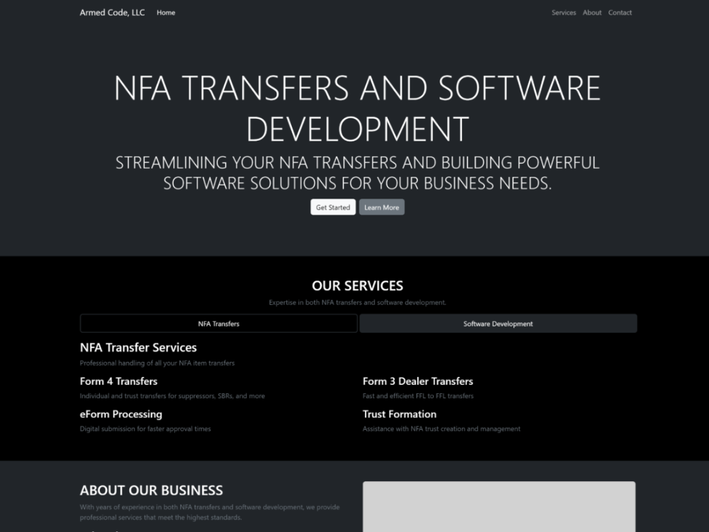

# Welcome to Armed Code, LLC

This is an [Armed Code, LLC](https://armedcodellc.com/) project bootstrapped with [`create-next-app`](https://github.com/vercel/next.js/tree/canary/packages/create-next-app).

## Who Am I?

Welcome to Armed Code, LLC — where precision meets performance in both firearms compliance and cutting-edge software development.
Founded with the vision to bridge the gap between the world of digital innovation and firearms industry compliance, Armed Code, LLC is proudly owned and operated by a federally licensed firearms professional and experienced full-stack software developer.

My name is Kevin Fonseca — and I wear two hats with confidence and integrity: one as a Federal Firearms Licensee (FFL 01) and Special Occupational Taxpayer (SOT 03), and the other as a seasoned JavaScript software engineer with years of hands-on experience building scalable, efficient, and maintainable digital solutions.

This dual expertise allows Armed Code, LLC to operate at a unique intersection of industries, offering services that are both regulatory-compliant and techno